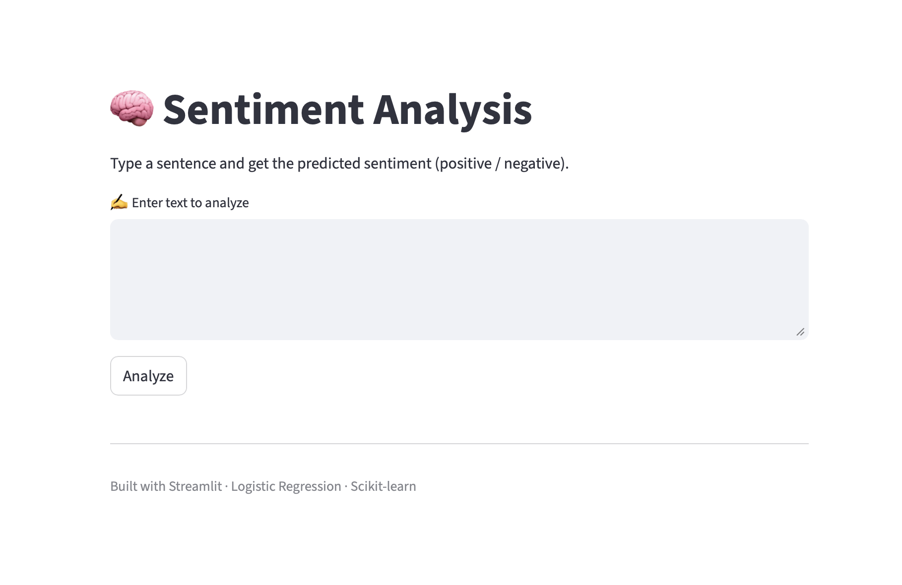

# 🧠 Sentiment Analysis Web App

A simple **Sentiment Analysis** project built with **Logistic Regression** and **TF–IDF Vectorizer**, featuring:
- ✅ Clean and modular Python code
- 💻 Command Line Interface (CLI)
- 🌐 Interactive Streamlit Web App
- 📝 Clear documentation

---

## 🚀 Demo

You can launch the app locally:
- streamlit run src/app_streamlit.py
- Then open http://localhost:8501 in your browser:

  

## 📦 Installation
Clone the repository and install dependencies:
- git clone https://github.com/Aras-Kavian/sentiment-analysis-project.git
- cd sentiment-analysis-project
- pip install -r requirements.txt

## 🧪 Usage

#### 1️⃣ CLI Mode
Run sentiment prediction from the command line:
- python src/predict.py "I love this product!"
- Expected output:
- Predicted sentiment: Positive

#### 2️⃣ Streamlit Web Interface
For a simple UI:
- streamlit run src/app_streamlit.py

## 🧠 Model
- Logistic Regression (Scikit-learn)
- TF–IDF Vectorizer
- Binary classification: Positive / Negative

## 📁 Project Structure
#### sentiment-analysis-project/
#### - ├── data/
-    ├── IMDB Dataset.csv
#### ├── notebook/
-    ├── sentiment_analysis_training.ipynb
#### - ├── src/
-    ├── app_streamlit.py
-    ├── app.py
-    ├── metrics.json
-    ├── train.py
-    ├── predict.py
-    ├── sentiment_model.pkl
-    └── vectorizer.pkl
- ├── requirements.txt
- ├── README.md
#### - └── assets/
-    └── demo_screenshot.png

## 🌍 Author & Links
#### 👤 Aras Kavyani / AI 1900
- 🔗 [GitHub](#www.github.com/Aras-Kavian)
- 🔗 [LinkedIn](#www.linkedin.com/in/aras-kavyani)
- 🔗 [LaborX Profile](#www.laborx.com/customers/users/id409982?ref=409982)
- 🔗 [CryptoTask Profile](#www.cryptotask.org/en/freelancers/aras-kavyan/46480)
- 🔗 [Twitter](#www.x.com/ai_1900?s=21)
